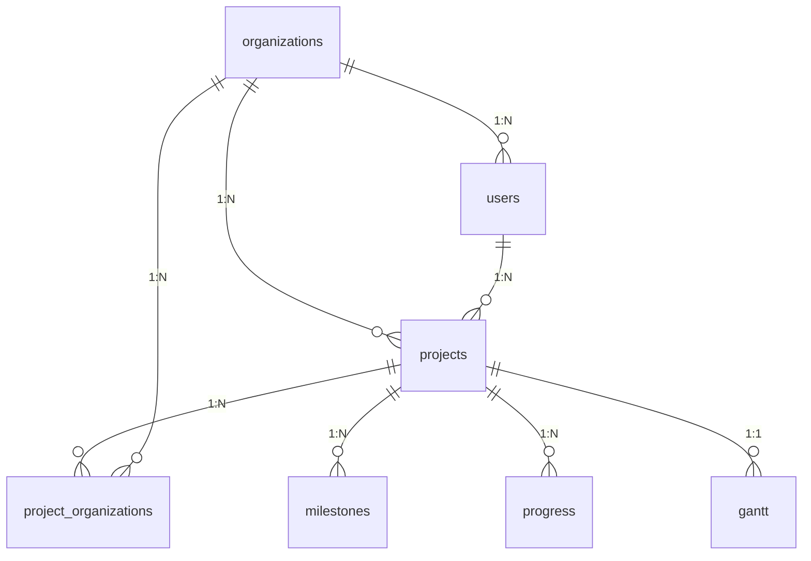

# LabMan 项目数据库结构文档

## 1. 组织表 (organizations)

```sql
CREATE TABLE organizations (
  id INTEGER PRIMARY KEY AUTOINCREMENT,
  name TEXT NOT NULL UNIQUE,  -- 组织名称
  type TEXT NOT NULL,         -- 组织类型
  createdAt TEXT DEFAULT CURRENT_TIMESTAMP,
  updatedAt TEXT DEFAULT CURRENT_TIMESTAMP
)
```

## 2. 项目表 (projects)

```sql
CREATE TABLE projects (
  id INTEGER PRIMARY KEY AUTOINCREMENT,
  name TEXT NOT NULL,         -- 项目名称
  type TEXT NOT NULL,         -- 项目类型
  status TEXT NOT NULL,       -- 项目状态
  startDate TEXT NOT NULL,    -- 开始日期
  endDate TEXT NOT NULL,      -- 结束日期
  budget REAL,                -- 预算
  description TEXT,           -- 项目描述
  expectedOutcomes TEXT,      -- 预期成果(JSON)
  taskDocument TEXT,          -- 任务书路径
  organizationId INTEGER NOT NULL,  -- 牵头单位ID
  leaderId INTEGER NOT NULL,  -- 项目负责人ID
  createdAt TEXT DEFAULT CURRENT_TIMESTAMP,
  updatedAt TEXT DEFAULT CURRENT_TIMESTAMP,
  FOREIGN KEY (organizationId) REFERENCES organizations(id),
  FOREIGN KEY (leaderId) REFERENCES users(id)
)
```

## 3. 项目-组织关系表 (project_organizations)

```sql
CREATE TABLE project_organizations (
  id INTEGER PRIMARY KEY AUTOINCREMENT,
  projectId INTEGER NOT NULL,      -- 项目ID
  organizationId INTEGER NOT NULL, -- 参与单位ID
  isLeader BOOLEAN NOT NULL DEFAULT 0, -- 是否牵头单位
  selfFunding DECIMAL(10,2) NOT NULL DEFAULT 0, -- 自筹经费
  allocation DECIMAL(10,2) NOT NULL DEFAULT 0,  -- 拨款经费
  leader TEXT NOT NULL,            -- 单位负责人
  participants TEXT,               -- 参与人员(JSON)
  expectedOutcomes TEXT,           -- 预期成果(JSON)
  createdAt TEXT DEFAULT CURRENT_TIMESTAMP,
  updatedAt TEXT DEFAULT CURRENT_TIMESTAMP,
  FOREIGN KEY (projectId) REFERENCES projects(id) ON DELETE CASCADE,
  FOREIGN KEY (organizationId) REFERENCES organizations(id),
  UNIQUE(projectId, organizationId)  -- 项目-组织唯一关系
)
```

## 4. 里程碑表 (milestones)

```sql
CREATE TABLE milestones (
  id INTEGER PRIMARY KEY AUTOINCREMENT,
  projectId INTEGER NOT NULL,  -- 所属项目ID
  title TEXT NOT NULL,         -- 里程碑标题
  description TEXT,            -- 描述
  type TEXT NOT NULL,          -- 类型(关键/普通)
  dueDate TEXT NOT NULL,       -- 截止日期
  status TEXT NOT NULL,        -- 状态
  completion REAL DEFAULT 0,   -- 完成度(0-100)
  notes TEXT,                  -- 备注
  createdAt TEXT DEFAULT CURRENT_TIMESTAMP,
  updatedAt TEXT DEFAULT CURRENT_TIMESTAMP,
  FOREIGN KEY (projectId) REFERENCES projects(id) ON DELETE CASCADE
)
```

## 5. 进度表 (progress)

```sql
CREATE TABLE progress (
  id INTEGER PRIMARY KEY AUTOINCREMENT,
  projectId INTEGER NOT NULL,  -- 所属项目ID
  kpiId TEXT NOT NULL,         -- KPI ID
  kpiName TEXT NOT NULL,       -- KPI名称
  target TEXT NOT NULL,        -- 目标值
  current TEXT,                -- 当前值
  status TEXT NOT NULL,        -- 状态
  completion REAL DEFAULT 0,   -- 完成度(0-100)
  notes TEXT,                  -- 备注
  updatedAt TEXT DEFAULT CURRENT_TIMESTAMP,
  FOREIGN KEY (projectId) REFERENCES projects(id) ON DELETE CASCADE
)
```

## 6. 甘特图表 (gantt)

```sql
CREATE TABLE gantt (
  id INTEGER PRIMARY KEY AUTOINCREMENT,
  projectId INTEGER NOT NULL,  -- 所属项目ID
  data TEXT NOT NULL,          -- 甘特图数据(JSON)
  updatedAt TEXT DEFAULT CURRENT_TIMESTAMP,
  FOREIGN KEY (projectId) REFERENCES projects(id) ON DELETE CASCADE
)
```

## 7. 用户表 (users)

```sql
CREATE TABLE users (
  id INTEGER PRIMARY KEY AUTOINCREMENT,
  username TEXT NOT NULL UNIQUE,  -- 用户名
  password TEXT NOT NULL,         -- 密码
  name TEXT NOT NULL,             -- 姓名
  role TEXT NOT NULL,             -- 角色
  idNumber TEXT,                  -- 身份证号
  position TEXT,                  -- 职务
  title TEXT,                     -- 职称
  education TEXT,                 -- 学历
  major TEXT,                     -- 专业
  researchArea TEXT,              -- 研究方向
  organizationId INTEGER,         -- 所属单位ID
  skills TEXT,                    -- 专业技能(JSON)
  responsibilities TEXT,          -- 职责(JSON)
  projectRole TEXT,               -- 项目角色
  theme TEXT DEFAULT '',          -- 主题设置
  darkMode INTEGER DEFAULT 0,     -- 暗黑模式(0/1)
  createdAt TEXT DEFAULT CURRENT_TIMESTAMP,
  FOREIGN KEY (organizationId) REFERENCES organizations(id)
)
```

## 表关系图



## 主要关系说明

1. 一个组织(organizations)可以有多个用户(users)
2. 一个组织(organizations)可以牵头多个项目(projects)
3. 一个项目(projects)可以关联多个组织(project_organizations)
4. 一个项目(projects)可以有多个里程碑(milestones)
5. 一个项目(projects)可以有多个进度指标(progress)
6. 一个项目(projects)对应一个甘特图(gantt)
7. 一个用户(users)可以负责多个项目(projects)
